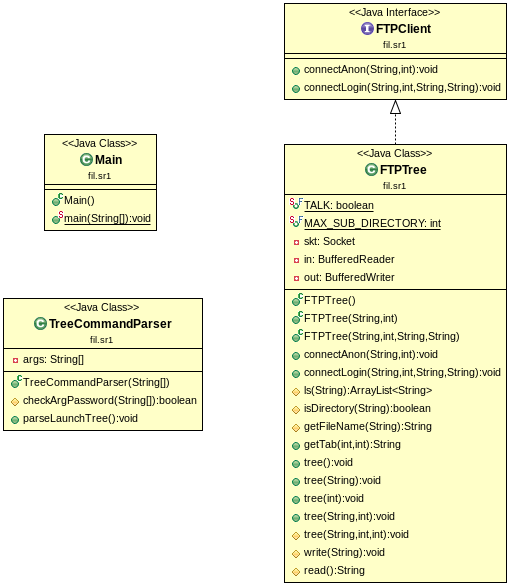
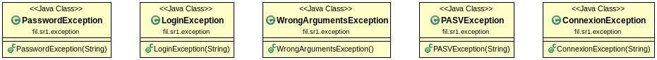

Application TreeFTP : TP de SR1  
Pierre-Louis Virey  
30/01/21  

# Introduction

Cette petite application permet de realiser la commande Tree sur un serveur FTP à partir d'une ligne de commande.  
L'implémentation de ce programme utilise simplement la librairie standard JAVA et ce compile avec l'outil Apache Maven.  

# Usage et installation

1. La compaliation de ce programme est faite avec l'outil Apache maven pour l'obtenir : `apt install maven`
2. Cloner le repository : `git clone https://github.com/Pierre-LouisV/SR-FTP-Tree.git`  
3. Déplacer vous dans le repertoire : `cd SR-FTP-Tree`  
4. Créer un executable : `mvn package`  
5. Pour lancer le programme plusieurs options sont dispoible qui suivent la syntaxe suivante :  
`java -jar TreeFtp.jar server_adress [[-u user] [-p password]] [-d directory] [-L level]`  
User et paddword sont à renseigner que si on l'on fait une connecion qui necessite une authentification.  

/!\ Les arguments doivent ABSOLUMENT respecter l'ordre présent dans la commande /!\  

Exemple de commandes valide :  
`java -jar target/TreeFTP-1.0.jar ftp.ubuntu.com -L 2`  
`java -jar target/TreeFTP-1.0.jar ftp.ubuntu.com -d cdimage -L 2`  
`java -jar target/TreeFTP-1.0.jar your.serv.com -u name -p passwd`  
`java -jar target/TreeFTP-1.0.jar your.serv.com -u name -p passwd -d yourFile`  

Exemple de commandes invalide :
`java -jar target/TreeFTP-1.0.jar cool.serv.com -L 2 -d cdimage` car inversion de -L et -d.  
`java -jar target/TreeFTP-1.0.jar cool.serv.com -u rate` car pas de -p pour ajouter le password.  

# Architecture

L'architecutre de ce programme est simple. Voici un diagramme de classe de l'application :



Le code dans la classe Main permet simplement de creer un objet TreeCommandParser qui lance la commande tree avec les bonnes options.  

On as une interface FTPClient qui représente un moyen d'avoir un client FTP.  

La classe FTPTree est le coeur de l'application, elle implémente la classe FTPClient car elle est un client d'un serveur FTP. Le code contenu dans cette classe permet de faire la commande tree sur le serveur FTP choisis par l'utilisateur.  

### Méthode polymorphes :
- Le constructeur FTPTree : Il as un constructeur vide pour pouvoir se connecter sois même grâce aux fonctions connect(). Le constructeur FTPTree(String adress, int port) appele lui le constructeur FTPTree(String adress, int port, String user, String passwd) avec en user et passwd les indentifiants pour une connection anonyme.
- La méthode tree : Ici on retrouve 5 méthodes tree avec un signature différente. Cela permet de filtrer les arguments pour lancer au final la méthode contenant le code du tree : tree(String directory, int level, int baseLevel). 

### Gestion des erreurs: 

Afin de gérer des erreurs qui peuvent arriver facilement avec une communication réseaux, plusieurs exceptions on été crées :



Voici pour chacune pourquoi elles sont levées :

- ConnexionException : Connexion impossible au serveur.
- LoginException : Le login n'est pas accpeté par le serveur.
- PasswordException : Le password n'est pas accpeté par le serveur.
- PASVException : La connexion passive as échouée.
- WrongArgumentsException : Les arguments passée en ligne de commandes ne respenctent pas la bonne syntaxe.

Dans le programme toutes les catch d'execptions entraine un arret de l'execution par une runtimeException.  

**Main**
- Catch de d'une WrongArgumentsException.  
**TreeCommandParser**
- Throw de WrongArgumentsException dans la méthode parseLaunchTree().
**FTPTree**
- Le constructeur ftp tree catch sois une ConnexionException ou LoginException ou PasswordException. La detection entraine l'arret du programme par une runtimeException.
- La méthode ls() throw une PASVException.
- La méthode tree() catch des IOException ou PASVException.
- Les méthodes read() et write() catch des IOException.

# Code Samples

### Execution de tree sur le serveur FTP.

L'implémentation de la méthode tree, qui permet d'afficher dans la sortie standard le resultat de la commande tree sur le repertoire directory. L'int level représente le niveau maximum de profondeur de la commande et baseLevel représente le niveau de base que l'on avais demandé.  
``` JAVA
protected void tree(String directory, int level, int baseLevel) {
    // Non execution de la fonction si le niveau n'est est de 0.
    if (level <= 0)
        return;

    try {
        ArrayList<String> lsReponse = ls(directory);	//Récupération de la commande ls sur le repo.
        String tab = getTab(level, baseLevel);			//Niveau d'indentation dans la console.
        for (int i = 0; i < lsReponse.size(); i++) {
            String file = lsReponse.get(i);
            String fileName = getFileName(file);
            
            if (i != lsReponse.size() - 1) {	//Choix de l'affichage pour l'estétique.
                System.out.println(tab + "├──" + fileName);
            } else {
                System.out.println(tab + "└──" + fileName);
            }
            if (isDirectory(file)) {	//Execution de la commande sur le noeud s'il s'agit d'un dossier.
                tree(directory + "/" + fileName, level - 1, baseLevel);
            }
        }
    } catch (IOException | PASVException e) {
        throw new RuntimeException(e);
    }
}
```

### Execution de LIST sur le serveur FTP

Ci-dessous le code permettant d'obetenir le resultat de la commande ls -al sur le serveur FTP. La fonction renvoie un ArrayList contenant pour chaque element une ligne de la réponse de la commande ls.

``` JAVA
protected ArrayList<String> ls(String directory) throws IOException, PASVException {
    // Connection en mode passif
    write("PASV");
    String reponse = read();
    if(!reponse.startsWith("227")) {
        throw new PASVException(reponse);
    }
    
    // On parse la réponse. On as comme format (IP1,IP2,IP3,IP4,PORT1,PORT2).
    ...
    // Calcul du port à utiliser pour la connection.
    ...

    //Liste du dossier directory.
    write("LIST " + directory);
    // Le nouveau socket pour lire les data.
    Socket sktData = new Socket(ipAdress, port);
    //Lecture de la réponse du serveur.
    read();
    
    //Création du socket permettant la connection.
    BufferedReader inData = new BufferedReader(new InputStreamReader(sktData.getInputStream()));

    String reponse2 = inData.readLine();
    ArrayList<String> lsResult = new ArrayList<String>();
    
    //Lecture de toutes les fichiers du dossier.
    while (reponse2 != null) {
        lsResult.add(reponse2);
        reponse2 = inData.readLine();
    }
    read();

    return lsResult;
}
```

### Connection au serveur

Le code suivant permet de se connecter au serveur précisé par l'adresse passée en argument. La fonction gère les problèmes de connexion grâce à ses exceptions.  

``` JAVA
public void connectLogin(String adress, int port, String user, String passwd) throws ConnexionException, LoginException, PasswordException {
    try {
        skt = new Socket(adress, port);		//Connection au socket du serveur.

        in = new BufferedReader(new InputStreamReader(skt.getInputStream()));		//Création du flux d'entrée.
        out = new BufferedWriter(new OutputStreamWriter(skt.getOutputStream()));	//Creation du flux de sortie.
    } catch (Exception e) {
        throw new ConnexionException(e.getMessage());
    }

    String reponse = read();

    write("USER " + user);		//Renseignement du nom d'utilisateur : user
    reponse = read();
    if(!reponse.startsWith("331")) {
        throw new LoginException(reponse);
    }
    
    write("PASS " + passwd);	//Renseignement du mot de passe.
    reponse = read();
    if(!reponse.startsWith("230")) {
        throw new PasswordException(reponse);
    }
}
```
### Système de dialogue

Le programme propose un système de dialogue pour débuggé de type ON / OFF. Il suffit de passer la variable TALK à true pour obtenir toutes les informations données par le serveur dans la sortie standard. La fonction retourne dans tous les cas la réponse lu.  

``` JAVA
public static final boolean TALK = false;			//Display the server messages if true

protected String read() {
    String reponse = "pb_read";
    try {
        reponse = in.readLine();
        if (TALK)
            System.out.println(reponse);
    } catch (IOException e) {
        throw new RuntimeException(e);
    }
    return reponse;
}
```

### Mauvaise exemple de lecture de ligne de commande.

Le code ci-dessous permet de lancer la commande tree avec les bons arguments. Cependant son implémentation est très cahotique car s'il l'on souhaité ajouter de nouveaux arguments est à ré-écrire.  
Je sors du contexte du README pour me justifier, j'avais envie d'ajouter un système de niveau et de cible de dossier. La solution la plus rapide pour parser les arguments est ce bout de code affreux. Sachant que c'est du bonus je me suis permis de faire cela.   

``` JAVA
public void parseLaunchTree() throws WrongArgumentsException {
    if(args.length == 0) {
        ...
    } else if (args.length == 1) {
        ...
    } else if (args.length > 4) {
        if (checkArgPassword(args)) { // Connexion with user and password.
            ...
            if (args.length == 7) {
                if (args[5].equals("-d")) {
                   ...
                } else { // On as un Level
                    ...
                }
            } else if (args.length == 9) {
                ...
            } else {
                ...
            }
        } else if (args.length == 5) {
            ...
        } else {
            ...
        }
    } else if (args.length == 3) {
        ...
        if (args[1].equals("-d")) {
            ...
        } else if (args[1].equals("-L")) { // On as un Level
            ...
        } else {
           ...
        }
    } else {
        throw new WrongArgumentsException();
    }
}
```
